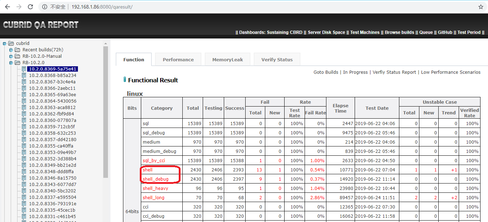
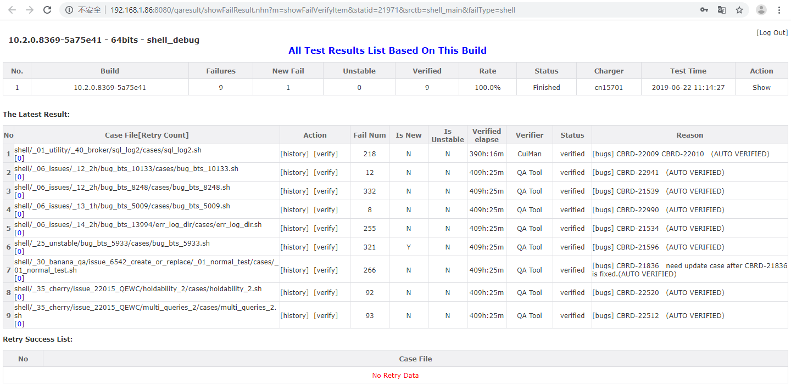

# Shell Test Guide
# 1 Test Introduction
Shell test is an important test suit in cubrid test.  
It contains almost all the feature test and some performance test which cannot be test by sql test or other test suits.  
The shell test cases url: [https://github.com/CUBRID/cubrid-testcases-private-ex/tree/develop/shell]( https://github.com/CUBRID/cubrid-testcases-private-ex/tree/develop/shell)  

# 2 Tools Introduction
CTP is the only test tool which is used in shell test.   
Source URL: [https://github.com/CUBRID/cubrid-testtools](https://github.com/CUBRID/cubrid-testtools)

# 3 Test Deployments
## 3.1 create and set users  
### controller node
We need create a new user: shell_ctrl.
Login root user and execute:  
```
sudo useradd shell_ctrl
```
Set password as our common password for user shell_ctrl.  
```
sudo passwd  shell_ctrl
```
 Set the user's password to never expire.  
 ```
 sudo chage -E 2999-1-1 -m 0 -M 99999 shell_ctrl
 ```
 
### worker nodes
We need create two new users: shell, dev.
Login root user and execute:  
```
sudo useradd shell
sudo useradd dev
```
Set password as our common password for user shell and user dev.  
```
sudo passwd  shell
sudo passwd  dev
```
 Set these users' password to never expire.  
 ```
 sudo chage -E 2999-1-1 -m 0 -M 99999 shell
 sudo chage -E 2999-1-1 -m 0 -M 99999 dev
 ```
## 3.2 install software packages
Required software packages: jdk, lcov, bc, lrzsz.   

|software|version|usage|  
|---|---|---|  
|jdk|1.8.0 (need larger than 1.6)|run CTP, run shell test case|  
|lcov|lcov-1.11|run code coverage test|  
|bc|latest version|run shell test case|  
|lrzsz|latest version|debug shell test case|  

These are installed by root user and can be used by all the users.  

## 3.3 Deploy controller node
### install CTP   
**Step 1: download CTP**  

*method 1: install from git*    
```
cd ~
git colne https://github.com/CUBRID/cubrid-testtools.git
cd cubrid-testtools
git checkout develop
cp -rf ~/cubrid-testtools/CTP ~
```  
*method 2: install from our server*     
```
cd ~
wget http://192.168.1.91:8080/REPO_ROOT/CTP.tar.gz
tar zxvf CTP.tar.gz
```  
Usually, we use method 2.

**Step 2: set CTP configuration files**    
*~/CTP/conf/common.conf*   
```
git_user=cubridqa
git_pwd=GITPASSWORD
git_email=dl_cubridqa_bj_internal@navercorp.com
default_ssh_pwd=PASSWORD
default_ssh_port=22

grepo_service_url=rmi://192.168.1.91:11099
coverage_controller_pwd=PASSWORD

qahome_db_driver=cubrid.jdbc.driver.CUBRIDDriver
qahome_db_url=jdbc:cubrid:192.168.1.86:33080:qaresu:dba::
qahome_db_user=dba
qahome_db_pwd=

qahome_server_host=192.168.1.86
qahome_server_port=22
qahome_server_user=qahome
qahome_server_pwd=PASSWORD

activemq_user=admin
activemq_pwd=admin
activemq_url=failover:tcp://192.168.1.91:61616?wireFormat.maxInactivityDurationInitalDelay=30000

mail_from_nickname=CUBRIDQA_BJ
mail_from_address=dl_cubridqa_bj_internal@navercorp.com
```
*~/CTP/conf/shell_template.conf* 
```
default.cubrid.cubrid_port_id=1568
default.broker1.BROKER_PORT=10090
default.broker1.APPL_SERVER_SHM_ID=10090
default.broker2.BROKER_PORT=13091
default.broker2.APPL_SERVER_SHM_ID=13091
default.ha.ha_port_id=19909

env.104.ssh.host=192.168.1.104
env.104.ssh.port=22
env.104.ssh.user=shell
env.104.ssh.pwd=PASSWORD

env.105.ssh.host=192.168.1.105
env.105.ssh.port=22
env.105.ssh.user=shell
env.105.ssh.pwd=PASSWORD

env.106.ssh.host=192.168.1.106
env.106.ssh.port=22
env.106.ssh.user=shell
env.106.ssh.pwd=PASSWORD

env.107.ssh.host=192.168.1.107
env.107.ssh.port=22
env.107.ssh.user=shell
env.107.ssh.pwd=PASSWORD

env.108.ssh.host=192.168.1.108
env.108.ssh.port=22
env.108.ssh.user=shell
env.108.ssh.pwd=PASSWORD

env.109.ssh.host=192.168.1.109
env.109.ssh.port=22
env.109.ssh.user=shell
env.109.ssh.pwd=PASSWORD

env.110.ssh.host=192.168.1.110
env.110.ssh.port=22
env.110.ssh.user=shell
env.110.ssh.pwd=PASSWORD

env.111.ssh.host=192.168.1.111
env.111.ssh.port=22
env.111.ssh.user=shell
env.111.ssh.pwd=PASSWORD

env.112.ssh.host=192.168.1.112
env.112.ssh.port=22
env.112.ssh.user=shell
env.112.ssh.pwd=PASSWORD

env.113.ssh.host=192.168.1.113
env.113.ssh.port=22
env.113.ssh.user=shell
env.113.ssh.pwd=PASSWORD

env.114.ssh.host=192.168.1.114
env.114.ssh.port=22
env.114.ssh.user=shell
env.114.ssh.pwd=PASSWORD

scenario=${HOME}/cubrid-testcases-private-ex/shell
test_continue_yn=false
cubrid_download_url=http://127.0.0.1/REPO_ROOT/store_02/10.1.0.6876-f9026f8/drop/CUBRID-10.1.0.6876-f9026f8-Linux.x86_64.sh
testcase_exclude_from_file=${HOME}/cubrid-testcases-private-ex/shell/config/daily_regression_test_excluded_list_linux.conf
testcase_update_yn=true
testcase_git_branch=develop
testcase_timeout_in_secs=604800
test_platform=linux
test_category=shell
testcase_exclude_by_macro=LINUX_NOT_SUPPORTED
testcase_retry_num=0
delete_testcase_after_each_execution_yn=false
enable_check_disk_space_yn=true

feedback_type=database
feedback_notice_qahome_url=http://192.168.1.86:8080/qaresult/shellImportAction.nhn?main_id=<MAINID>

owner_email=Mandy<cui.man@navercorp.com>

git_user=cubridqa
git_email=dl_cubridqa_bj_internal@navercorp.com
git_pwd=N6P0Sm5U7h

feedback_db_host=192.168.1.86
feedback_db_port=33080
feedback_db_name=qaresu
feedback_db_user=dba
feedback_db_pwd=
```
shell_template.conf will be copied to \~/CTP/conf/shell_runtime.conf when test is started.  
For more details about the parameters, please refer to CTP guide.  

### set ~/.bash_profile 
*~/.bash_profile*  
```
# .bash_profile

# Get the aliases and functions
if [ -f ~/.bashrc ]; then
        . ~/.bashrc
fi

# User specific environment and startup programs

PATH=$JAVA_HOME/bin:$HOME/CTP/common/script:$PATH:$HOME/.local/bin:$HOME/bin

export PATH

export CTP_BRANCH_NAME="develop"
export CTP_SKIP_UPDATE=0
```

### create a script to start consumer
~/start_test.sh
```
nohup start_consumer.sh -q QUEUE_CUBRID_QA_SHELL_LINUX -exec run_shell &
```
Execute the script to start listening the test message after deployment. This will start a shell test when the consumer receive the test message.
```
cd ~
sh start_test.sh
```

## 3.4 Deploy worker node  
### install CTP
This step is the as 'install CTP' on controller node. Plese refer to [install CTP](#install_CTP).  
### set ~/.bash_profile
*~/.bash_profile*
```
# .bash_profile

# Get the aliases and functions
if [ -f ~/.bashrc ]; then
        . ~/.bashrc
fi

# User specific environment and startup programs

PATH=$PATH:$HOME/.local/bin:$HOME/bin

export CTP_HOME=$HOME/CTP
## init_path is used when we run shell case manually on this machine.
export init_path=$CTP_HOME/shell/init_path

export PATH=$CTP_HOME/bin:$CTP_HOME/common/script:$PATH

export CTP_BRANCH_NAME="develop"
export CTP_SKIP_UPDATE=0

. ~/.cubrid.sh
export GCOV_PREFIX=/home/shell
export GCOV_PREFIX_STRIP=2
ulimit -c unlimited
```

### deploy test cases
```
git clone --no-checkout https://github.com/CUBRID/cubrid-testcases-private-ex.git
cd ~/cubrid-testcases-private-ex
git config core.sparseCheckout true
echo 'shell/*' > ~/cubrid-testcases-private-ex/.git/info/sparse-checkout
git checkout develop
```

### make directories for test
```
cd
mkdir do_not_delete_core
mkdir ERROR_BACKUP
```

### create .cubrid.sh file 
If cubrid has never been installed on the machine, we need create file '.cubrid.sh' at $HOME path manually
*.cubrid.sh file:*   
```
CUBRID=/home/shell/CUBRID
CUBRID_DATABASES=$CUBRID/databases
if [ "x${LD_LIBRARY_PATH}x" = xx ]; then
  LD_LIBRARY_PATH=$CUBRID/lib
else
  LD_LIBRARY_PATH=$CUBRID/lib:$LD_LIBRARY_PATH
fi
SHLIB_PATH=$LD_LIBRARY_PATH
LIBPATH=$LD_LIBRARY_PATH
PATH=$CUBRID/bin:$PATH
export CUBRID
export CUBRID_DATABASES
export LD_LIBRARY_PATH
export SHLIB_PATH
export LIBPATH
export PATH
```

# 4 Regression Test
We execute shell test for each CI build, and execute code coverage test monthly. Both of these test are started automatically when the controller receive a test message. We just need to prepare the conf files, verify the test results, and report issues.

## 4.1	Set conf files for regression test
Edit the file: ~/CTP/conf/shell_template.conf.  
shell_template.conf will be copied to \~/CTP/conf/shell_runtime.conf when test is started.  
For more details, please refer to ['install CTP'](#install_CTP)

## 4.2 Verify dailyqa test results
### Result overview
Open qahome in browser, then select build number. 'Function Result' page will be displayed.
Find shell and shell_debug in linux part, and find shell in windows part.


In the overview page, we should check the values in all the colomns. The most important check items are:  
1. Whether the test is completed ('Test Rate' column)
2. How many cases are failed('Failed' columns)
3. The elapse time of the case ('Elapse Time' column). The elapse time of the test should not be longer than the elapse time of the previous should too much.  

### verfy the failed cases
Click the link in this image to open the online verification page.  
  
On the verification page, click 'Log in' to login.  
  
After logging in, we can start to verify the failed cases online.    
    
**Click the link in 'Case File' column to check the case and the screen output.**  
  
**'[history]':** check the test case history failure   
*history page*    
   
**'[verify]':** open the case's verification page to write the verification result   
*case verification page*   
  
On this page:
1. select a failure reason.  
2. write some comments in 'Reason content'  
3. write the issue number in 'New issues' or 'New issues'  
4. click the button at the bottom to close this page.  
Fix: I am sure of this verication result.  
Save: I am not sure of this verication result. I will decide it later.  

Sometimes, we cannot find the failure reason from the screen output directly. At this time, we need login the test machine, go to the case path, check the logs. If we still cannot find the failure reason from the logs, we should run the case step by step on this machine to find the failure reason.

## 4.3 Verify code coverage test result
Go to QA homepage and find the 'code coverage' node in the left area, click the link of the latest result.  

## 4.4 Report issues
### Crash issue  
If there is a crash, report it following the rules in this link: [‘How to Report Regression Crash Issues’](http://jira.cubrid.org/browse/CUBRIDQA-1?focusedCommentId=4739244&page=com.atlassian.jira.plugin.system.issuetabpanels:comment-tabpanel#comment-4739244)  

### normal issue  
If the the test result is as expected, first we should confirm whether it is revise required. If not, report it as an issue on jira.   

# 5 Execute Test  
# 5.1 Execute a single test case  
To execute a single test case, we juse need to login a test machine, and go to the case path, and then execute shell command 'sh case_name.sh'.  

# 5.2 Execute a shell test  
We can use the regression tools to trigger a test.  
1. Change the parameters in ~/CTP/conf/shell_template.conf on controller node.    
2. Send a message to start the test  
Login: message@192.168.1.91  
Send test message as:  
```
sender.sh QUEUE_CUBRID_QA_SHELL_LINUX http://192.168.1.91:8080/REPO_ROOT/store_01/10.2.0.8330-d4d8464/drop/CUBRID-10.2.0.8330-d4d8464-Linux.x86_64.sh shell default
```
3. Start consumer on the controller node  
If the consumer is not started, login the controller node to start it.  
```
cd ~
sh start_test.sh 
```
4. Check test result  
The results will be uploaded to qahome automatically. You can follow section 4.2 to check the test results.  

# 6 Code Coverage Test
For code coverage test, just need to send a message.  
Login: message@192.168.1.91  
Send test message as:  
```
cd ~/manual
sh sender_code_coverage_testing_message.sh Queue:QUEUE_CUBRID_QA_SHELL_LINUX Build URL:http://192.168.1.91:8080/REPO_ROOT/store_01/10.2.0.8270-c897055/drop/CUBRID-10.2.0.8270-c897055-gcov-Linux.x86_64.tar.gz Source URL:http://192.168.1.91:8080/REPO_ROOT/store_01/10.2.0.8270-c897055/drop/cubrid-10.2.0.8270-c897055-gcov-src-Linux.x86_64.tar.gz Category:shell
```
The result will be uploaded to qahome automatically.  
To check the result, please refer to ['Verify code coverage test result'](#Verify-code-coverage-test-result) 

# 7 Run test manually
1. Login controller node.
2. Set the conf file ~/CTP/conf/shell_template.conf.
3. run ctp
```
ctp.sh shell -c conf/shell_template.conf
```

# 8 Tips

# 9 shell case standards

